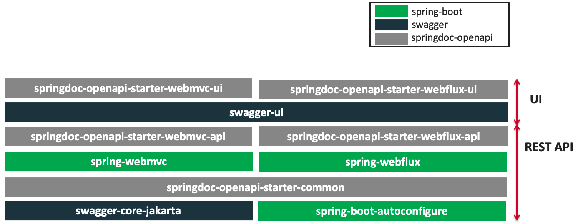
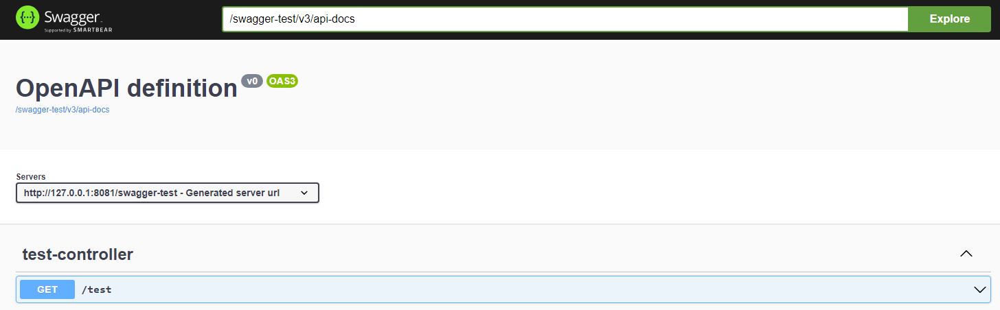
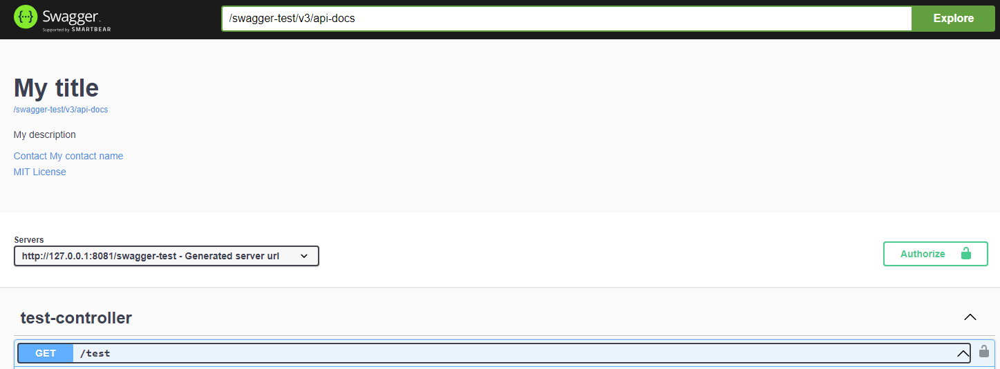
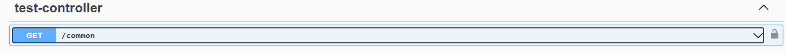
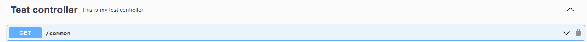
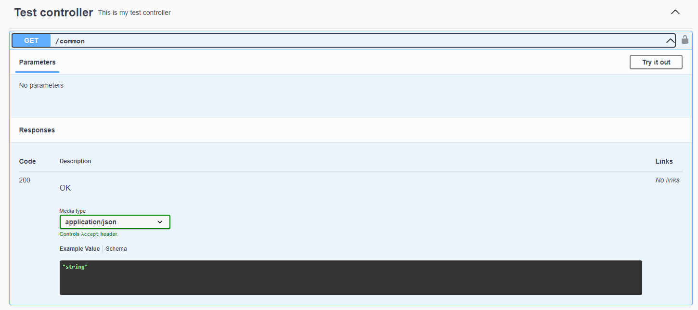
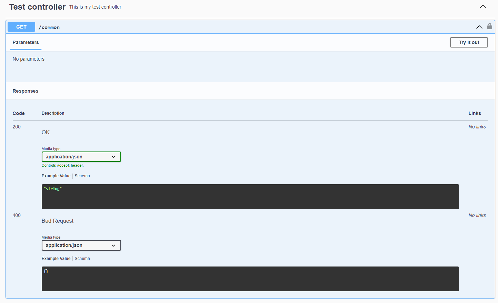
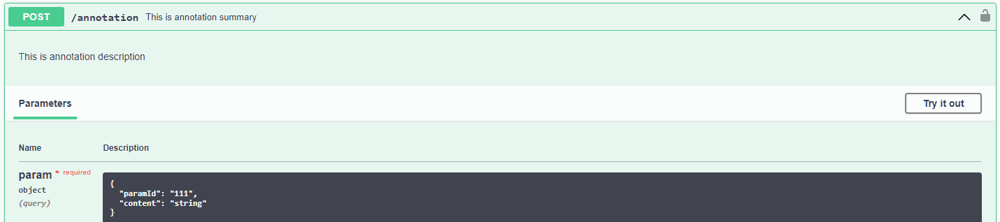
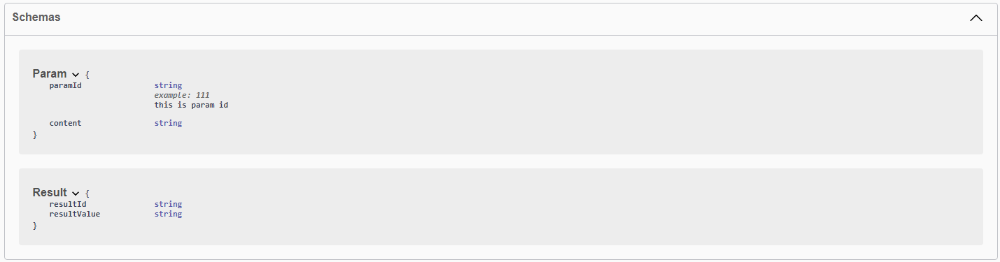

# openapi-swagger

## What is [OpenAPI](https://swagger.io/specification/)

```markdown
OpenAPI Specification (formerly Swagger Specification) is an API description format for REST APIs. An OpenAPI file allows you to describe your entire API, including: Available endpoints (/users) and operations on each endpoint (GET /users, POST /users) Operation parameters Input and output for each operation Authentication methods Contact information, license, terms of use and other information.
OpenAPI规范(以前称为Swagger规范)是REST API的API描述格式。OpenAPI文件允许您描述整个API，包括:可用的端点(/users)和每个端点上的操作(GET /users, POST /users)操作参数每个操作的输入和输出认证方法联系信息，许可，使用条款和其他信息。

A self-contained or composite resource which defines or describes an API or elements of an API. The OpenAPI document MUST contain at least one paths field, a components field or a webhooks field. An OpenAPI document uses and conforms to the OpenAPI Specification.
定义或描述API或API元素的自包含或组合资源。OpenAPI文档必须包含至少一个路径字段，一个组件字段或一个webhooks字段。OpenAPI文档使用并符合OpenAPI规范。
```

## What is [Swagger](https://swagger.io/)

```markdown
Swagger是一个规范和完整的Api框架，用于生成、描述、调用和可视化 RESTful 风格的 Web 服务。  
总体目标是使客户端和文件系统作为服务器以同样的速度来更新。  
文件的方法，参数和模型紧密集成到服务器端的代码，允许API来始终保持同步。
```

## What is [Springdoc](https://springdoc.org/)

```markdown
springdoc-openapi java library helps to automate the generation of API documentation using spring boot projects. springdoc-openapi works by examining an application at runtime to infer API semantics based on spring configurations, class structure and various annotations.
Automatically generates documentation in JSON/YAML and HTML format APIs. This documentation can be completed by comments using swagger-api annotations.

springdoc-openapi java库帮助使用spring引导项目自动生成API文档。springdoc-openapi通过在运行时检查应用程序来推断基于spring配置、类结构和各种注释的API语义。自动生成JSON/YAML和HTML格式的api文档。此文档可以通过使用swagger-api注释的注释来完成。

This library supports:
* OpenAPI 3
* Spring-boot v3 (Java 17 & Jakarta EE 9)
* JSR-303, specifically for @NotNull, @Min, @Max, and @Size.
* Swagger-ui
* OAuth 2
* GraalVM native images

This is a community-based project, not maintained by the Spring Framework Contributors (Pivotal).
```

### pom引入Springdoc

**下面包根据需要引入**
**springdoc.version 2.1.0需要java17 和 spring boot v3**

```xml
<dependency>
    <groupId>org.springdoc</groupId>
    <artifactId>springdoc-openapi-starter-webmvc-ui</artifactId>
    <version>2.1.0</version>
</dependency>
```
```xml
<dependency>
    <groupId>org.springdoc</groupId>
    <artifactId>springdoc-openapi-ui</artifactId>
    <version>1.7.0</version>
</dependency>
```


### Swagger 开关

```properties
# Disabling the /v3/api-docs endpoint
springdoc.api-docs.enabled=false
# Disabling the swagger-ui
springdoc.swagger-ui.enabled=false
```

### 设置swagger html地址

```markdown
Default URL
  Swagger UI page: http://server:port/context-path/swagger-ui.html
  OpenAPI description for json format: http://server:port/context-path/v3/api-docs
  OpenAPI description for yaml format: http://server:port/context-path/v3/api-docs.yaml
```

```properties
# swagger-ui custom path
springdoc.swagger-ui.path=/swagger-ui.html
# /api-docs endpoint custom path
springdoc.api-docs.path=/api-docs
```


### 设置API Information and Security documentation

```markdown
The library uses spring-boot application auto-configured packages to scan for the following annotations in spring beans: OpenAPIDefinition and Info. These annotations declare, API Information: Title, version, licence, security, servers, tags, security and externalDocs. For better performance of documentation generation, declare @OpenAPIDefinition and @SecurityScheme annotations within a spring managed bean.

该库使用spring引导应用程序自动配置的包来扫描spring bean中的以下注释:openapidedefinition和Info。这些注释声明API信息:标题、版本、许可证、安全性、服务器、标签、安全性和externalDocs。为了提高文档生成的性能，请在spring托管bean中声明@ openapidedefinition和@SecurityScheme注释。
```
```java
import io.swagger.v3.oas.annotations.OpenAPIDefinition;
import io.swagger.v3.oas.annotations.enums.SecuritySchemeType;
import io.swagger.v3.oas.annotations.info.Contact;
import io.swagger.v3.oas.annotations.info.Info;
import io.swagger.v3.oas.annotations.info.License;
import io.swagger.v3.oas.annotations.security.SecurityRequirement;
import io.swagger.v3.oas.annotations.security.SecurityScheme;
import org.springframework.context.annotation.Configuration;

@OpenAPIDefinition(
        info = @Info(
                title = "My title",
                description = "My description",
                version = "0.0.1",
                contact = @Contact(name = "My contact name", email = "My contact email"),
                license = @License(name = "MIT License", url = "License url")
        ),
        security = @SecurityRequirement(
                name = "bearerAuth",
                scopes = {}
        )
)
@SecurityScheme(type = SecuritySchemeType.HTTP, name = "bearerAuth", scheme = "bearer")
@Configuration
public class SwaggerConfig {}
```


### Controller tag

* common
```java
@RestController
public class TestController {
    @GetMapping(value = "/common", produces = MediaType.APPLICATION_JSON_VALUE)
    public String test() {
        return "Access successful";
    }
}
```

* common with tag
```java
@RestController
@Tag(name = "Test controller", description = "This is my test controller")
public class TestController {
    @GetMapping(value = "/common", produces = MediaType.APPLICATION_JSON_VALUE)
    public String test() {
        return "Access successful";
    }
}
```


### Error Handling for REST using @ControllerAdvice

* common
```java
@RestController
@Tag(name = "Test controller", description = "This is my test controller")
public class TestController {
    @GetMapping(value = "/common", produces = MediaType.APPLICATION_JSON_VALUE)
    public String test() {
        return "Access successful";
    }
}
```


* common with controller advice
```java
@ControllerAdvice
public class ExceptionAdvice {
    @ExceptionHandler(CustomException.class)
    @ResponseStatus(HttpStatus.BAD_REQUEST)
    @RequestMapping(produces = MediaType.APPLICATION_JSON_VALUE)
    public ResponseEntity<?> handleException(CustomException customException) {
        return ResponseEntity.status(HttpStatus.BAD_REQUEST).body("Test error");
    }
}
```


### Selecting the Rest Controllers to include in the documentation

```properties
# Packages to include
springdoc.packagesToScan=com.package1, com.package2
# Paths to include
springdoc.pathsToMatch=/v1, /api/balance/**
```

```markdown
Additionally, to @Hidden annotation from swagger-annotations, its possible to restrict the generated OpenAPI description using package or path configuration.
```

### Annotation

```java
@RestController
@Tag(name = "Test controller", description = "This is my test controller")
public class TestController {
    @PostMapping(value = "/annotation", produces = MediaType.APPLICATION_JSON_VALUE)
    @Operation(description = "This is annotation description", summary = "This is annotation summary")
    public Result testAnnotation(Param param) {
        return new Result();
    }
}
public class Param {
    @Schema(description = "this is param id", example = "111")
    private String paramId;
    private String content;
}
```



### Further study
Study in https://springdoc.org/#faq
